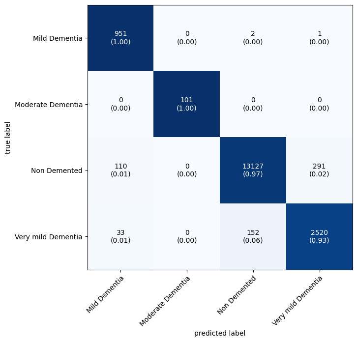

# 🧠 OASIS Alzheimer's Classification

## 📌 Overview

This project focuses on **Alzheimer's disease classification** using deep learning. The model is trained on the **OASIS dataset**, which contains brain MRI images labeled for different stages of Alzheimer's. The repository includes code for **data preprocessing, model training, evaluation, and performance analysis** within a Jupyter Notebook.

## 🚀 Features

- 📊 **Exploratory Data Analysis (EDA)**: Understanding dataset distribution and visualizing sample MRI scans.
- 🏋️‍♂️ **Deep Learning Model Implementation**: Utilizing CNN-based architectures for Alzheimer's classification.
- 🖼️ **Data Preprocessing**: Image normalization, resizing, and tensor conversion for deep learning models.
- 🎯 **Training & Evaluation**: Implements optimizer tuning, loss function tracking, and performance evaluation.
- 📈 **Performance Metrics**: Analyzing loss curves, accuracy, and confusion matrices.
- 🔍 **Class Weights Handling**: Uses **`class_weights_ratio.pth`** file to balance dataset classes.

## 📁 Project Structure

```
📂 OASIS-ALZHEIMER-CLASSIFICATION
│-- 📂 models/ # Directory for saved models
    |--📜 pytorch_alzheimer_cnn_model.pth # Saved CNN Model                 
│-- 📜 .gitignore                # Git ignore file
│-- 📜 class_weights_ratio.pth    # File containing class weights for balancing
│-- 📜 main.ipynb                # Jupyter Notebook with the entire workflow
│-- 📜 README.md                 # Project documentation
│-- 📜 requirements.txt          # Dependencies for running the project
```

## ⚙️ Installation

1. Clone the repository:

   ```bash
   git clone https://github.com/yourusername/OASIS-Alzheimer-Classification.git
   cd OASIS-Alzheimer-Classification
   ```

2. Install dependencies:

   ```bash
   pip install -r requirements.txt
   ```

## 🏋️‍♂️ Running the Notebook

Open the Jupyter Notebook and execute the cells step by step:

```bash
jupyter notebook main.ipynb
```

### Notebook Workflow:

1. **Data Loading & Exploration**: 
   - Load MRI scans and analyze dataset distribution.
   - Display sample images.

2. **Preprocessing**:
   - Resize, normalize, and convert images to tensors.
   - Handle class imbalance using **class_weights_ratio**.

3. **Model Training**:
   - Define the CNN architecture.
   - Train the model using cross-entropy loss and Adam optimizer.
   - Track loss and accuracy across epochs.

4. **Model Evaluation**:
   - Compute accuracy, loss, and confusion matrix.
   - Visualize model predictions.

## 📌 Usage

1. **Load the trained model within the notebook**:
   ```python
   import torch
   from models.model import CustomCNNModel

   model = CustomCNNModel()
   model.load_state_dict(torch.load("models/pytorch_alzheimer_cnn_model.pth"))
   model.eval()
   ```

2. **Make predictions on a new MRI scan**:
   ```python
   from PIL import Image
   from torchvision import transforms

   transform = transforms.Compose([transforms.Resize((128, 128)), transforms.ToTensor()])
   image = Image.open("path_to_mri_image.jpg")
   image = transform(image).unsqueeze(0)

   with torch.no_grad():
       prediction = model(image)
       predicted_class = prediction.argmax(dim=1).item()

   print(f"Predicted Class: {predicted_class}")
   ```

## 📊 Results
### Accuracy Scores
- Training accuracy: **96%**
- Testing accuracy: **96%**

### Confusion Matrix
- 


## 📌 To-Do List

- [ ] Improve model architecture for better classification accuracy.
- [ ] Fine-tune hyperparameters for better generalization.

## 📜 License

This project is licensed under the **MIT License**.

## 🤝 Contributing

Contributions are welcome! To contribute:

1. Fork the repository
2. Create a new branch (`feature-xyz`)
3. Commit changes (`git commit -m "Added feature xyz"`)
4. Push to your branch (`git push origin feature-xyz`)
5. Open a Pull Request


